# Mascots

*See also: [Mascots/Gallery](Gallery)*

## Official

###  pippi

::: Infobox

#### pippi

|  |  |
| :-- | :-- |
| **Affiliation** | osu! |
| **Design** | ::{ flag=US }:: [Sarumaru](https://osu.ppy.sh/users/9427) |
| **Created** | July 2008 |

:::

pippi, stylised with a lowercase "p", is the mascot of the osu! game mode since June 2008. She also appears in osu!taiko's default skin, where she is known as pippidon. The initial concept art was created by ::{ flag=US }:: [Sarumaru](https://osu.ppy.sh/users/9427), the pippidon sprite was created by ::{ flag=HK }:: [crystalsuicune](https://osu.ppy.sh/users/9974), and the current art was designed by ::{ flag=US }:: [Daru](https://osu.ppy.sh/users/32480).

In the game, pippi pops out of the side of the screen at every [combo milestone](/wiki/Gameplay/Combo_milestone) and is also seen on the client's crash window. In the [osu!(lazer) client](/wiki/Client/Release_stream/Lazer), she appears in UI artwork in the account registration screen, as well as the beatmap listing when no search results are found.

On the website, she appears in fan art scattered throughout various pages, such as the top of the [Featured Artist listing](https://osu.ppy.sh/beatmaps/artists) and placeholder error screens.

Outside of osu!, pippi made a cameo appearance in [Yandere Simulator](https://yanderesimulator.com) as an NPC.

###  Mocha

::: Infobox

#### Mocha

|  |  |
| :-- | :-- |
| **Affiliation** | osu!taiko |
| **Design** | ::{ flag=US }:: [Crowie](https://osu.ppy.sh/users/6894067) |
| **Created** | 25 May 2017 |

:::

*For the news post, see: [The new osu!taiko mascot is here!](https://osu.ppy.sh/home/news/2017-05-25-the-new-osutaiko-mascot-is-here)*

Mocha is the osu!taiko mascot. She was initially designed during the [sixth fanart contest](https://osu.ppy.sh/community/contests/2) by ::{ flag=US }:: [Crowie](https://osu.ppy.sh/users/6894067), which has been ranked 21st from the polls.

###  Yuzu

::: Infobox

#### Yuzu

|  |  |
| :-- | :-- |
| **Affiliation** | osu!catch |
| **Design** | ::{ flag=US }:: [ztrot](https://osu.ppy.sh/users/6347) |
| **Created** |  |

:::

*For the news posts, see: [Meet Yuzu!](https://osu.ppy.sh/home/news/2014-06-21-meet-yuzu) and [Introducing Yuzu's New Look](https://osu.ppy.sh/home/news/2019-01-09-introducing-yuzu)*

Yuzu is the osu!catch mascot that joined on 2014-06-22. He was born on 2000-04-10, is 172 centimetres tall, and weighs 65 kilograms. His current art design was designed by ::{ flag=US }:: [Thievley](https://osu.ppy.sh/users/4717672). Whereas his initial art design and catcher sprites were done by ::{ flag=US }:: [ztrot](https://osu.ppy.sh/users/6347); Daru created the comboburst art.

###  Mani & Mari

::: Infobox

#### Mani & Mari

|  |  |
| :-- | :-- |
| **Affiliation** | osu!mania |
| **Design** | ::{ flag=US }:: [Thievley](https://osu.ppy.sh/users/4717672) |
| **Created** | 17 September 2020 |

:::

*For more information, see: [Introducing Mani and Mari, the New osu!mania Mascots.](https://osu.ppy.sh/home/news/2020-09-17-introducing-mani-mari-osumania)*

Designed by ::{ flag=ID }:: [xiemon](https://osu.ppy.sh/users/5203667) after being scouted from the [Most Manic Art Contest](https://osu.ppy.sh/community/contests/80) and announced as the official osu!mania mascots on 2020-09-18, Mani and Mari are twins who can't quite stand each other, but are more similar than they'd care to admit.

Mani is something of a maverick, always looking to explore new styles and things, while his sister Mari (formerly known as Maria) is a rigid, classical perfectionist with a penchant for the spotlight. The two get along like oil and water.

## Cameos

### Ryūta Ippongi

::: Infobox

#### Ryūta Ippongi

|  |  |
| :-- | :-- |
| **Affiliation** | Osu! Tatakae! Ouendan |

:::

> He is the hot-blooded leader of the cheer squad. He has a good soul and helps those around him who are in distress by standing up and fighting for them!

一本木龍太 (Ryūta Ippongi) was the osu!catch chibi-fruit catcher that had joined in 2008, but was replaced by [Yuzu](#yuzu) in 2014. He was created by [iNiS Corporation](https://en.wikipedia.org/wiki/INiS) and was once part of the old website. He also appeared in [Yandere Simulator](https://yanderesimulator.com) as an NPC.

Ryuuta was also featured in ::{ flag=US }:: [LuigiHann](https://osu.ppy.sh/users/1079)'s skin, [Elite Beat osu! HD (1.0 Complete!)](https://osu.ppy.sh/community/forums/topics/190357).

### Agent J

::: Infobox

#### Agent J

|  |  |
| :-- | :-- |
| **Affiliation** | Osu! Tatakae! Ouendan |

:::

> An expert in many styles of dance ranging from hip-hop to ballet, J can mesmerize any living thing.

Agent J, also known as BA-2 (Beat Agent-2) or J, was one of the osu! mascots in 2008 but had retired in 2014. He was created by iNiS Corporation and was once part of the old website.

Agent J was also featured in ::{ flag=US }:: [LuigiHann](https://osu.ppy.sh/users/1079)'s skin, [Elite Beat osu! HD (1.0 Complete!)](https://osu.ppy.sh/community/forums/topics/190357).

###  Don

::: Infobox

#### Don

|  |  |
| :-- | :-- |
| **Affiliation** | Taiko no Tatsujin |
| **Design** | Yukiko Yokoo (横尾有希子) |

:::

> Don is the protagonist of the [Taiko no Tatsujin](https://en.wikipedia.org/wiki/Taiko_no_Tatsujin) series. He is a taiko drum with a white edge and four legs, a red face (which appears to be moly orange), and a light blue body. Don's dream is to share the beauty of Taiko with the world. Three years have passed since he moved into the Wada House, and he's become quite popular around town. He has a monstrous appetite and sometimes has expensive shopping at the Wada House which may take over for the worst. He usually ends his sentences with "Ta-don", meaning "Ba-dum" in Japanese.

和田どん (Wada Don), also known as Don or Don-chan, was one of the osu! mascots for osu!taiko that joined in 2008-05. He is 48 centimetres tall and weighs more than 100 kilograms. He appears in the skin for osu!taiko. His art was designed by Yukiko Yokoo (横尾有希子) and was voiced by Narahashi Miki (楢橋 美紀).

## Community

###  Aiko

::: Infobox

#### Aiko

|  |  |
| :-- | :-- |
| **Affiliation** | osu!taiko |
| **Design** | ::{ flag=ID }:: [JMC](https://osu.ppy.sh/users/774010) |
| **Created** | 22 August 2016 |

:::

Aiko was one of the entries in the osu!taiko mascot design contest. She is an energetic girl with a passion for osu!taiko, even if she is not the best at it! Sporting a pair of stylish "Tabi" shoes and a retinue of pippidon accessories, the mascot of yore lives on in this spunky girl. She is fairly short at only 154 centimetres, and was born on 1999-04-06.

###  Alisa

::: Infobox

#### Alisa

|  |  |
| :-- | :-- |
| **Affiliation** | osu!taiko |
| **Design** | ::{ flag=AE }:: [\[ Glitch \]](https://osu.ppy.sh/users/3781400) |
| **Created** | 22 August 2016 |

:::

Alisa was one of the entries in the osu!taiko mascot design contest. She has been playing osu!taiko ever since her early childhood. Fond of playing songs for others, she is very musically oriented, and when she is not sleeping or eating, she is playing osu!taiko, or playing retro video games for kicks!

###  Chirou

::: Infobox

#### Chirou

|  |  |
| :-- | :-- |
| **Affiliation** | osu!taiko |
| **Design** | ::{ flag=US }:: [pyun](https://osu.ppy.sh/users/981534) |
| **Created** | 22 August 2016 |

:::

Chirou was one of the entries in the osu!taiko mascot design contest. She is very strict and demanding, a perfectionist, and does not like making mistakes — especially in her beats in osu!taiko. But past her strong outlook, if you get to her soft spot, she can be fluffy and cute. She is 14 years old, born on October 25th with blood type AB. She is also 4 feet 11 inches and weighs 100 pounds. Her hobbies include practising drumming, keeping warm in her cape, and collecting gems or rocks. Chirou has made some appearances in various user fanart submissions.

###  Chloe

::: Infobox

#### Chloe

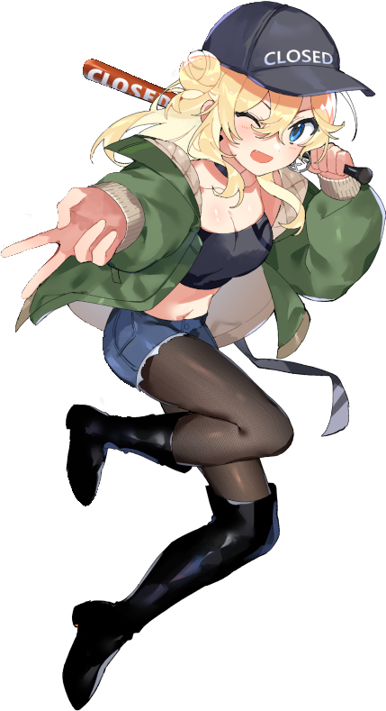

|  |  |
| :-- | :-- |
| **Affiliation** | Corsace "Secretary" |
| **Design** | [Nemururin](https://osu.ppy.sh/users/26391825) |
| **Created** | 2024 |

:::

Chloe is the mascot of the Corsace tournament series.

###  IRIS

::: Infobox

#### IRIS

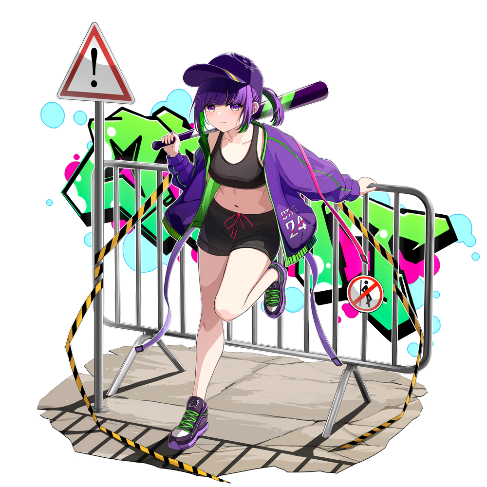

|  |  |
| :-- | :-- |
| **Affiliation** | osu!taiko Malaysia |
| **Design** | HiroChair & th_nore |
| **Created** | 2022 |

:::

A carefree spirit with a penchant for violence, IRIS was a proud member of the Prism High Student Council, until her role was cut short due to her violent tendencies in managing the student body.

She is extremely competitive when it comes to games, even to the point of throwing violent tantrums whenever she loses. Because of this, she does not have many friends.

###  Marvia Etsuko

::: Infobox

#### Marvia Etsuko

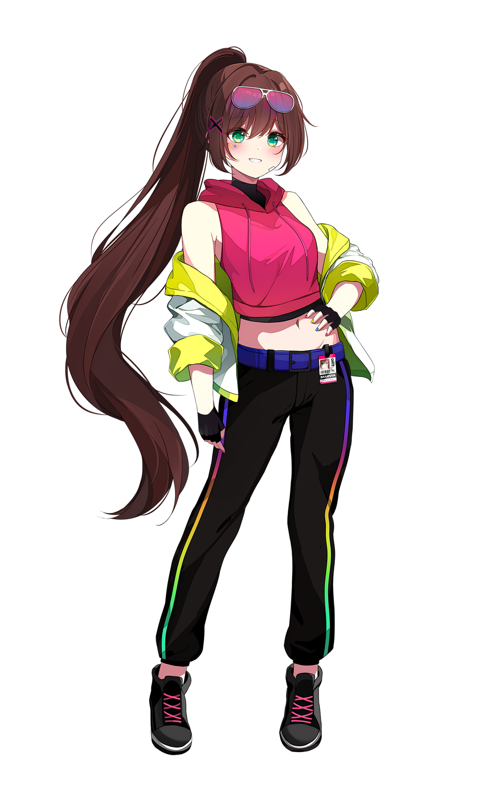

|  |  |
| :-- | :-- |
| **Affiliation** | osu! Malaysia |
| **Design** | [Iyouka](https://osu.ppy.sh/users/7138499) & apple |
| **Created** | 2022 |

:::

Marvia is the mascot of osu! Malaysia

###  Maya

::: Infobox

#### Maya

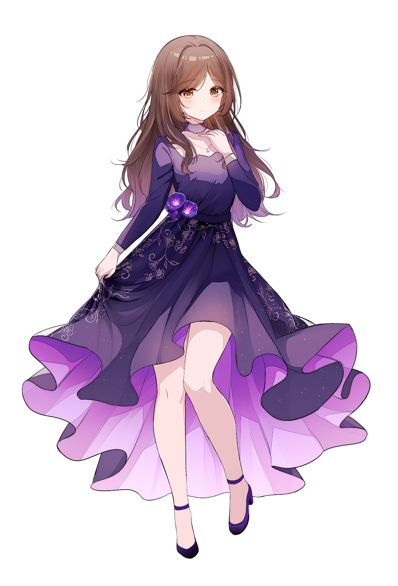

|  |  |
| :-- | :-- |
| **Affiliation** | osu!mania Malaysia |
| **Design** | [ERA Leon](https://osu.ppy.sh/users/13382147) |
| **Created** | 2023 |

:::

Maya is the mascot of the osu!mania Malaysia community

###  Naru

::: Infobox

#### Naru

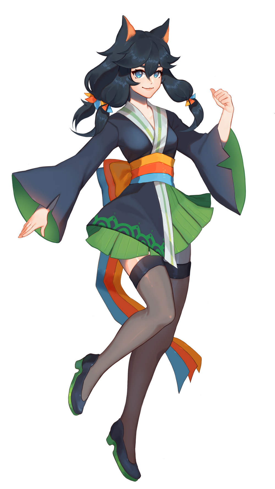

|  |  |
| :-- | :-- |
| **Affiliation** | Global Taiko Showdown |
| **Design** | its_spec |
| **Created** | 2019 |

:::

Naru is the mascot of the Global Taiko Showdown tournament series.

###  Primrea

::: Infobox

#### Primrea

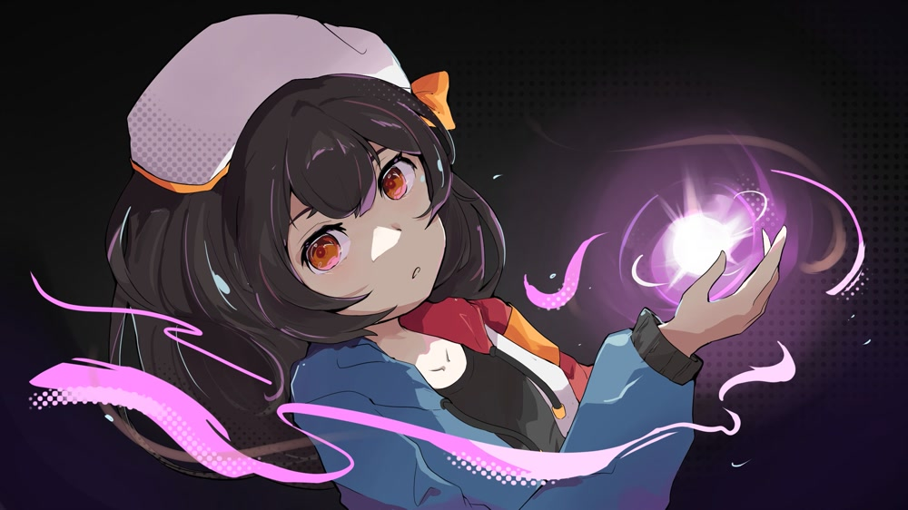

|  |  |
| :-- | :-- |
| **Affiliation** | osu! Philippines |
| **Design** | [cromrea](https://osu.ppy.sh/users/943743) |
| **Created** | 2011 |

:::

Primrea is the mascot of the osu! Philippine community.

###  Project Prism student council

#### Aloiv

::: Infobox

#### Aloiv

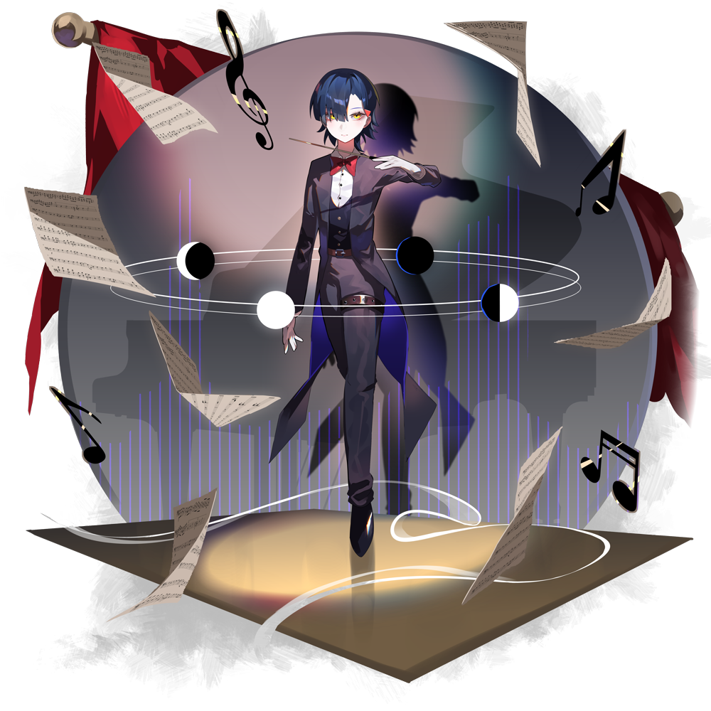

|  |  |
| :-- | :-- |
| **Affiliation** | Project Prism "Treasurer" |
| **Design** | HiroChair |
| **Created** | 2024 |

:::

Born into a sheltered life under an aristocratic family, Aloiv rejects the burden of their familial expectations by pursuing a passion in music. At the age of just 4, Aloiv became a well respected conductor of the national orchestra, noted for their prodigal abilities in mastering nearly every instrument.

Despite having an abundance of wealth, Aloiv is very particular about how money is spent, thus earning them the Treasurer role of the council.

#### Bagel

::: Infobox

#### Bagel

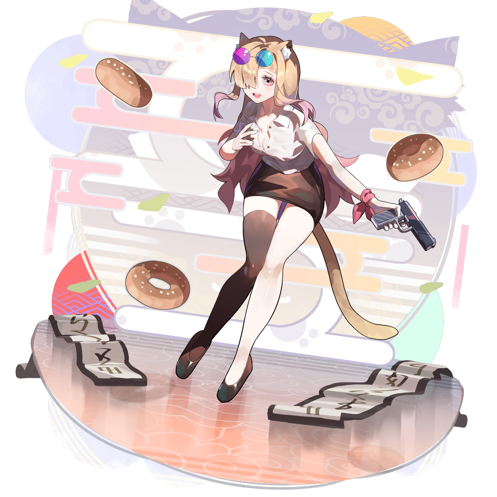

|  |  |
| :-- | :-- |
| **Affiliation** | Project Prism "Vice President" |
| **Design** | HiroChair |
| **Created** | 2024 |

:::

As the head shrine maiden of her family-owned temple in the city, Bagel is heavily tied to her traditional roots. The mundane life of the temple walls, incense and prayer bells led her to pick up a hobby in modelling as a form of escape, where she quickly gained a substantial following.

Why does she have a cat tail and ears? Well... that's a story for another day.

#### Mayu Glynne

::: Infobox

#### Mayu Glynne

|  |  |
| :-- | :-- |
| **Affiliation** | Project Prism "Event Manager" |
| **Design** | th_nore |
| **Created** | 2024 |

:::

Being bound to a wheelchair at birth, Mayu developed a keen passion for robotics to work around her limitations, as well as to help others in overcoming theirs. Her genius as the president of the Robotics Club earned the attention of the council, where she's currently its youngest member. Passionate, kind, and well loved by everyone, Mayu is an exemplary member of Prism High's council.

However, rumour has it that a different side of her can be seen when her glasses are off...

#### Nina Oberin

::: Infobox

#### Nina Oberin

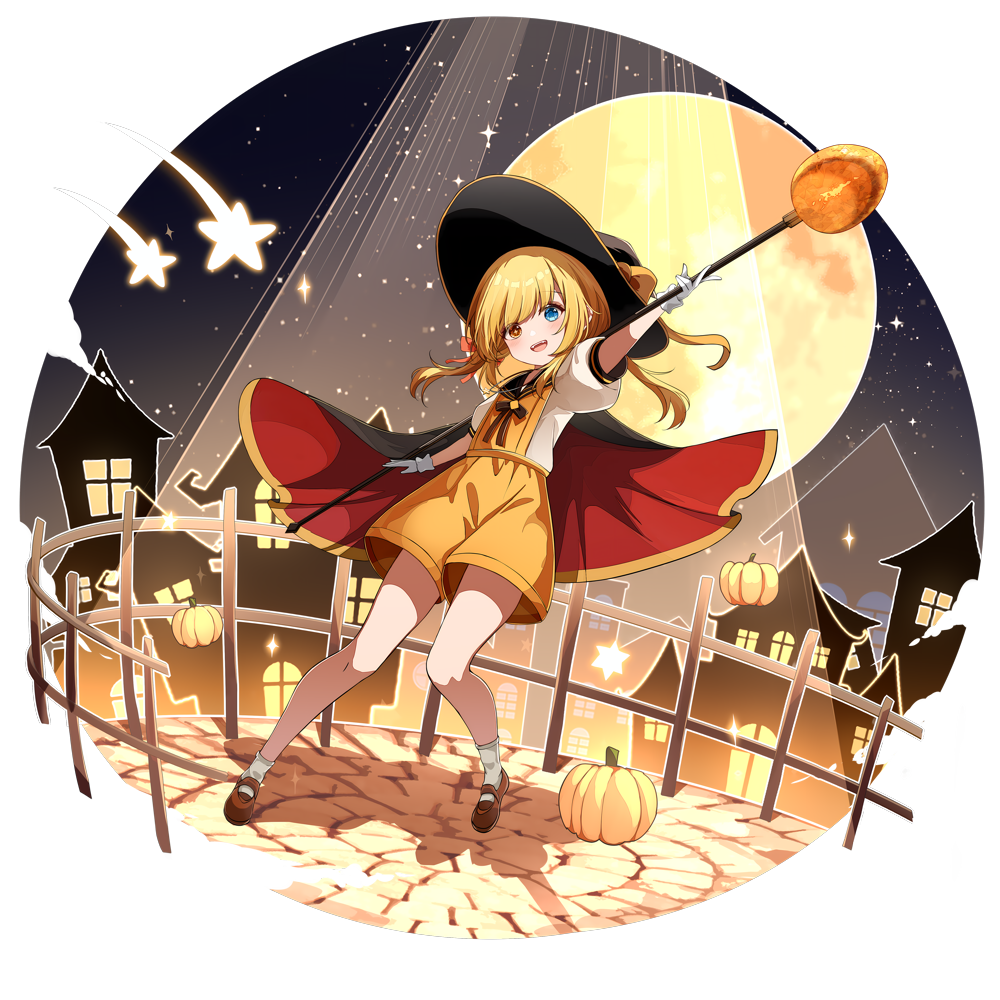

|  |  |
| :-- | :-- |
| **Affiliation** | Project Prism "Secretary" |
| **Design** | th_nore |
| **Created** | 2024 |

:::

Born into a sheltered life under an aristocratic family, Aloiv rejects the burden of their familial expectations by pursuing a passion in music. At the age of just 4, Aloiv became a well respected conductor of the national orchestra, noted for their prodigal abilities in mastering nearly every instrument.

Despite having an abundance of wealth, Aloiv is very particular about how money is spent, thus earning them the Treasurer role of the council.

#### Scarlette

::: Infobox

#### Scarlette

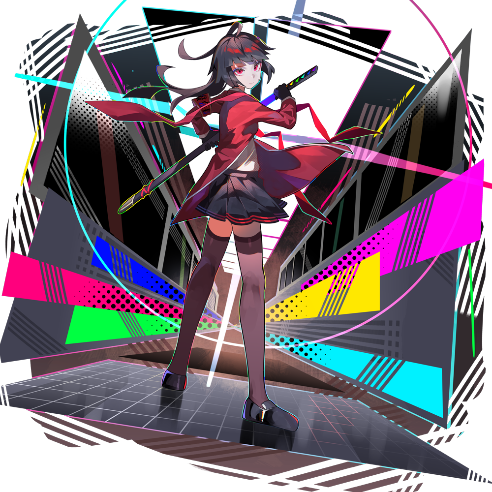

|  |  |
| :-- | :-- |
| **Affiliation** | Project Prism "President" |
| **Design** | HiroChair |
| **Created** | 2024 |

:::

Perfect grades, unmatched athletics and a knack for leadership, Scarlette is the quintessential president of the council. With a tendency of taking things too seriously, she has trouble empathising with others, resulting in being given the nickname of "Red Ice Queen" by the students.

Outside the public eye, Scarlette is extremely devoted to those she cares about, going above and beyond in making sure they are happy. However, when paired with her lack of awareness towards social nuances, this can sometimes result in her trying a little bit too hard.

#### Zander

::: Infobox

#### Zander

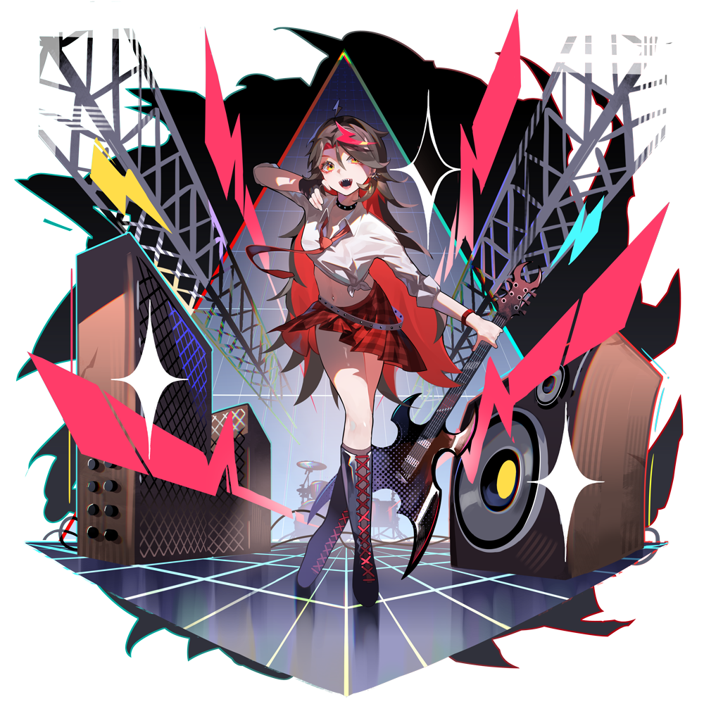

|  |  |
| :-- | :-- |
| **Affiliation** | Project Prism "Social Media Manager" |
| **Design** | HiroChair |
| **Created** | 2024 |

:::

As the lead guitarist and vocalist of the popular school band ЯEFRACT, Zander is an upbeat girl who manages the council's publicity and image. Her loud and energetic nature allows her to break through all social barriers and make friends with quite literally anyone.

###  Serenity

::: Infobox

#### Serenity

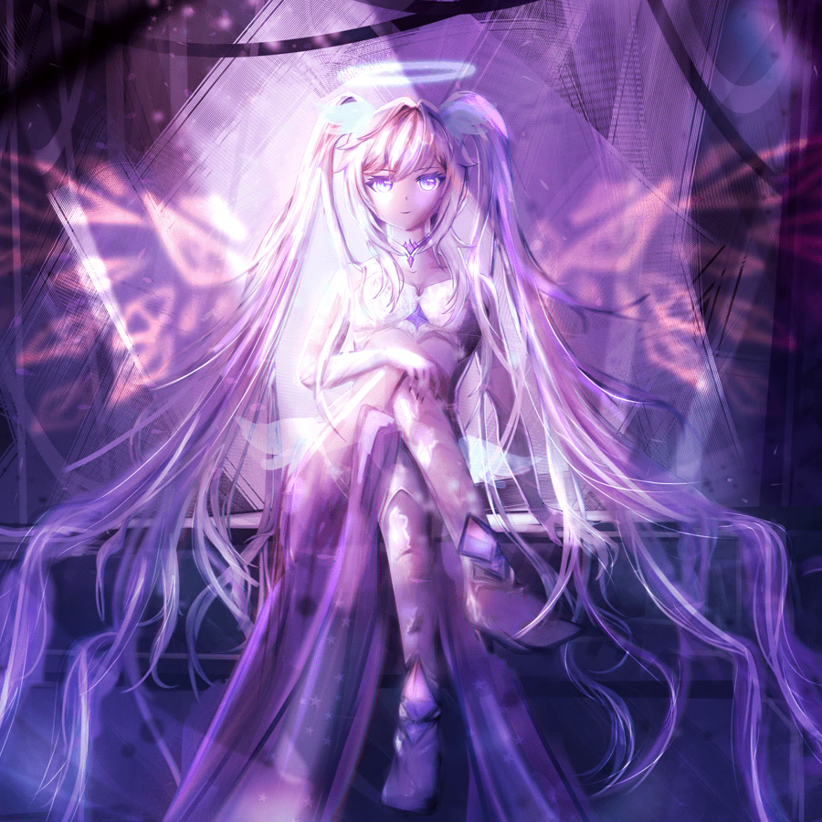

|  |  |
| :-- | :-- |
| **Affiliation** | Resurrection Cup |
| **Design** | Yumeyo |
| **Created** | 2024 |

:::

Serenity is the mascot of the Resurrection Cup tournament series

###  Taikonator

::: Infobox

#### Taikonator

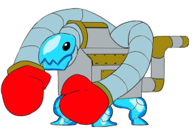

|  |  |
| :-- | :-- |
| **Affiliation** | osu!taiko |
| **Design** | ::{ flag=PL }:: [Lemia-Chan](https://osu.ppy.sh/users/8506749) |
| **Created** | 2022 August 2016 |

:::

Taikonator, also known as Taikonator 3000, was one of the entries in the osu!taiko mascot design contest. He has gained some traction as an inside joke and popularity for unknown reasons. His origins remains a mystery; despite this, he is far more unique than the other osu!taiko mascot design submissions and has made many appearances in various user fanart submissions.

###  Tama

::: Infobox

#### Tama

|  |  |
| :-- | :-- |
| **Affiliation** | osu!taiko |
| **Design** | ::{ flag=HK }:: [crystalsuicune](https://osu.ppy.sh/users/9974) |
| **Created** | 22 August 2016 |

:::

Tama was one of the younger entrants in the osu!taiko mascot design contest at only age 15 (or is she?), and has a huge passion for taiko drumming. And thunderstorms. And especially festivals, where she snatches up any takoyaki she can find. Always up for the challenge, Tama hides a particularly mysterious past behind her youthful demeanor.
