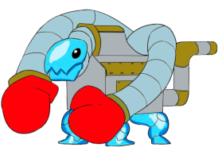

# Maskotar

*Se även: [Mascots/Gallery](/wiki/Mascots/Gallery)*

En YouTube-video som visar alla osu! maskotar kan ses i [Mascot Showcase](https://youtu.be/mJF2cAs_MrI).

## Officiella

###  pippi

pippi, stiliserad med ett litet "p", är maskoten i osu!standard och gick med juli 2008. Hon är även känd som pippidon i osu!taiko dök upp i [Yandere Simulator](https://yanderesimulator.com) som en NPC. Det första concept art skapades av [Sarumaru](https://osu.ppy.sh/users/9427), pippidons sprite skapades av [crystalsuicune](https://osu.ppy.sh/users/9974), och nuvarande designen skapades av [Daru](https://osu.ppy.sh/users/32480).

###  Yuzu

*För nyhetsartiklarna, se: [Meet Yuzu!](https://osu.ppy.sh/home/news/2014-06-21-meet-yuzu) och [Introducing Yuzu's New Look](https://osu.ppy.sh/home/news/2019-01-09-introducing-yuzu)*

Yuzu är maskoten i osu!catch som gick med den 22 juni 2014. Han föddes den 10 april 2000, är 172 centimeter lång och väger 65 kg. Hans nuvarande design designades av [Thievley](https://osu.ppy.sh/users/4717672) och ursprungligen var hans design och fångar-sprites gjorda av [ztrot](https://osu.ppy.sh/users/6347). Daru skapade comboburst-designen.

###  Maria

*För nyhetsartikeln, se: [Meet Maria - osu!mania’s new mascot!](https://osu.ppy.sh/home/news/2016-04-20-meet-maria-osumanias-new-mascot)*

Maria är maskoten i osu!mania som gick med den 4 mars 2016. Bilderna på henne designades av Daru.

###  Mocha

*För nyhetsartikeln, se: [The new osu!taiko mascot is here!](https://osu.ppy.sh/home/news/2017-05-25-the-new-osutaiko-mascot-is-here)*

Mocha är maskoten i osu!taiko. Hon var ursprungligen designad under den [sjätte fanart-tävlingen](https://osu.ppy.sh/community/contests/2) av [Crowie](https://osu.ppy.sh/users/6894067), som kom på 21:a plats i enkäten.

## Cameos

### Ryūta Ippongi

> Han är ledaren av hejarklacken med hög temperament. Han har en god själ och hjälper personer i nöd runtom honom genom stå upp och slåss åt dem!

一本木龍太 (Ryūta Ippongi) chibi-frukt fångaren i osu!catch som gick med år 2008, men byttes ut till [Yuzu](#-yuzu) år 2014. Han skapades av [iNiS Corporation](https://en.wikipedia.org/wiki/INiS) och var en gång en del av den gamla hemsidan. Han dök också upp i [Yandere Simulator](https://yanderesimulator.com) som en NPC.

Ryuuta har också framträtt i ett skin skapat av [LuigiHann](https://osu.ppy.sh/users/1079), [Elite Beat osu! HD (1.0 Complete!)](https://osu.ppy.sh/community/forums/topics/190357/).

### Agent J

> En expert i många dansstilar från hip-hop till balett, J kan hypnotisera allt levande.

Agent J, också kallad BA-2 (Beat Agent-2) eller J, var en av maskotarna i osu! år 2008 men avgick år 2014. Han skapades av iNiS Corporation och var en gång en del av den gamla hemsidan.

Agent J har också framträtt i ett skin skapat av [LuigiHann](https://osu.ppy.sh/users/1079), [Elite Beat osu! HD (1.0 Complete!)](https://osu.ppy.sh/community/forums/topics/190357/).

### Don

> Don är protagonisten i serien [Taiko no Tatsujin](https://en.wikipedia.org/wiki/Taiko_no_Tatsujin). Han är en taiko-trumma med vit kant och har fyra ben, ett rött ansikte (som ser orange ut), och en ljusblå kropp. Dons dröm är att dela med sig sjönheten av Taiko med världen. Det var tre år sedan han flyttade in till Wada House, och han har blivit ganska populär runtom i stan. Han har en enorm aptit och ibland shoppar dyrt i Wada House, vilket kan sluta illa. Han brukar avsluta sina meninar med "Ta-don", som betyder "Ba-dum" på japanska.

和田どん (Wada Don), också kallad Don eller Don-chan, var en av maskottarna i osu! för osu!taiko som gick med 2008-05. Han är 48 centimeter lång och väger mer än 100 kg. Han förekommet i skinnet för osu!taiko. Hans design skapades av Yukiko Yokoo (横尾有希子) och hans röst är av Narahashi Miki (楢橋 美紀).

## Community

### Aiko

Designad av [JMC](https://osu.ppy.sh/users/774010), Aiko var en av deltagarna i osu!taiko maskot design-tävlingen. Hon är en energiskt flicka med passion för osu!taiko, även om hon inte är det bästa i det! Med ett par "Tabi"-skor och en mängd av pippidon-accessoarer, den gamla maskoten lever kvar i denna djärva flicka. Hon är rätt så kort vid bara 154 centimeter och föddes den 6 april 1999.

### Alisa

Designad av [\[ Glitch \]](https://osu.ppy.sh/users/3781400), Alisa var en av deltagarna i osu!taiko maskot design-tävlingen. Hon har spelat osu!taiko ända sedan tidig barndom. Hon är väldigt musikalisk och tycker om att spela låtar inför andra. När hon inte äter eller sover spelar hon osu!taiko eller retro-spel för skojs skull!

### Chirou

Designed av [pyun](https://osu.ppy.sh/users/981534), Chirou var en av deltagarna i osu!taiko maskot design-tävlingen. Hon är väldigt strikt och petig, en perfektionist, och gillar inte att göra misstag—speciellt när hon trummar i osu!taiko. Men bortom hennes starka utseende, om du kommer på hennes goda sida, kan hon vara fluffig och söt. Hon är 14 år gammal, född 25 oktober och har blodtyp AB. Hon är 150 centimeter lång och väger 45 kg. Som hobby övar hon på att trumma, håller värmen i sin kappa och samlar på juveler eller stenar. Chirou har förekommit i olika inlämningar av fanart.

### Taikonator

Taikonator, också kallad Taikonator 3000, var en av deltagarna i osu!taiko maskot design-tävlingen. Han fick fäste och blev populär som ett internt skämt för okända anledningar. Hans förekomst förblir ett mysterium. Trots det är han mycket mer unik än de andra inlämningarna i osu!taiko maskot design-tävlingen och har förekommit i många andras fanart.

### Tama

Designad av [crystalsuicine](https://osu.ppy.sh/users/9974), Tama var en av de yngre deltagarna i osu!taiko maskot design-tävlingen på bara 15 år (eller är hon det?), Tama har en stor passion för att trumma taiko. Och åskväder. Och speciellt festivaler, där hon tar för sig all takoyaki hon kan hitta. Alltid redo för utmaning, Tama döljer en särskild mystisk bakgrund bakom hennes ungdomliga beteende.
